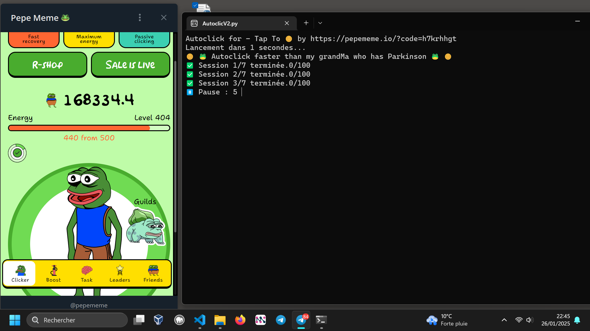

## AutoClic for PepeMeme.io in Telegram 🐸🪙 

##### ONE

    pip install ctypes
    pip install pyautogui
    pip install time
    pip install winsound

##### TWO

        [Join pepememe Tap to Earn in telegram](https://t.me/pepememe?start=r-7610823899)
        open app 'Pepe Meme'
        use the **coordonateCMD.py** 
        write your coordonate in *pyautogui.click(000, 000)* line 31 in **AutoclicV2.py**
        run and earn

### I Code after sleep this **AutoclicV1.py**

### next day

### Second day - with **AutoclicV2.py**

### Third day

 

#### Tap to earn powered by Telegram ⬇️
[Join pepememe Tap to Earn in telegram](https://t.me/pepememe?start=r-7610823899)

##### Other Good Plan
[Mysterium-network](https://savoir-relatif-et-absolu.netlify.app/mysterium-network)

[Publish0x.com](https://savoir-relatif-et-absolu.netlify.app/publish0x-earn-token)

#### For donation if you use my tool 😊
[USDC / BTC or Paypal](https://fiboscope.netlify.app/donation)
